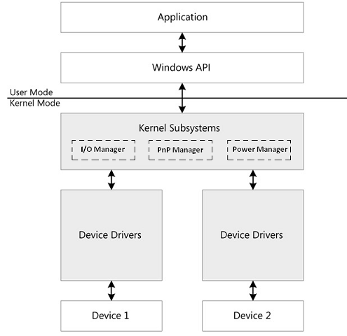
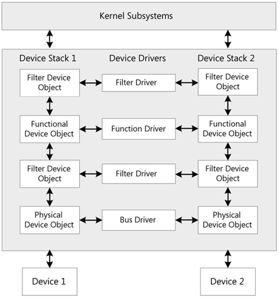
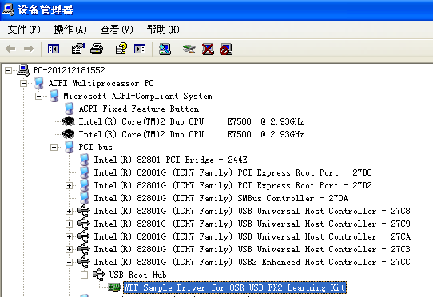
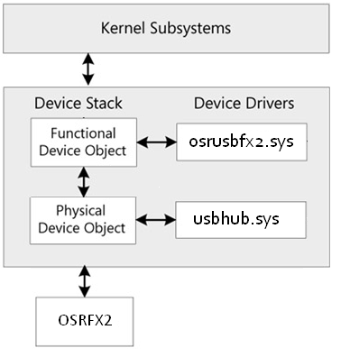
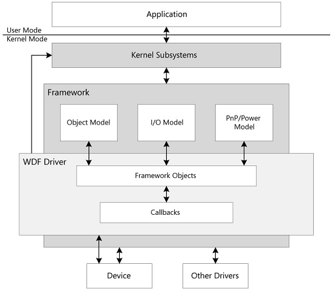
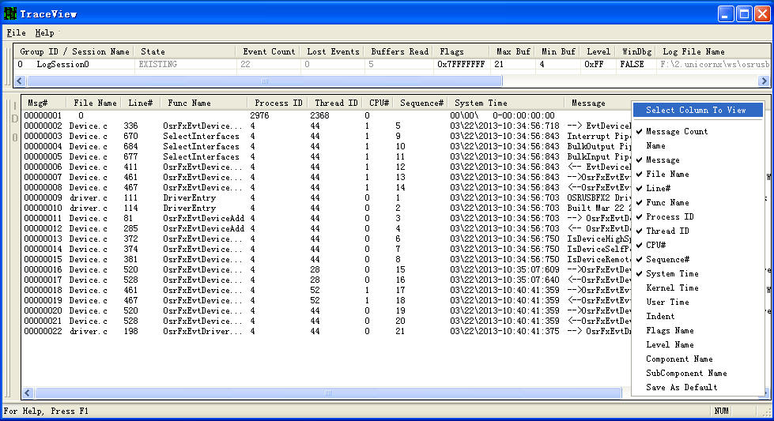

# **Step by Step, 为OSRFX2创建一个KMDF驱动程序**

## 总目录
###[**Chapter 1. 基础知识**](#chapter-1)  

[**1.1 Windows驱动的一些基本知识**](#1.1)  
[1.1.1 Windows系统架构](#1.1.1)  
[1.1.2 设备对象和设备栈](#1.1.2)  
[1.1.3 设备节点和设备树](#1.1.3)  

[**1.2 WDF简介**](#1.2)  
[1.2.1. 设计良好的对象模型](#1.2.1)  
[1.2.2. 统一的I/O模型](#1.2.2)  
[1.2.3. PnP和Power管理模型-状态机](#1.2.3)  

###[**Chapter 2. OSRUSBFX2 - Step By Step**](#chapter-2)  

[**2.1. Step1 - 创建一个最简单的KMDF功能驱动**](#2.1)  
[2.1.1. 驱动入口点DriverEntry](#2.1.1)  
[2.1.2. 添加新设备入口点EvtDriverDeviceAdd](#2.1.2)  

[**2.2. Step2 - 准备设备对象**](#2.2)  
[2.2.1. 为OSRFX2注册设备接口(device interface](#2.2.1)  
[2.2.2. 为OSRFX2添加上下文](#2.2.2)  
[2.2.3. 为OSRFX2准备I/O目标对象](#2.2.3)  

[**2.3. Step3 - USB同步控制传输**](#2.3)  
[2.3.1. 注册I/O控制码](#2.3.1)  
[2.3.2. 添加队列](#2.3.2)  
[2.3.3. 处理I/O控制](#2.3.3)  

[**2.4. Step4 - USB异步批量传输**](#2.4)  
[2.4.1. 注册回调函数](#2.4.1)  
[2.4.2. 添加I/O Target对象](#2.4.2)  
[2.4.3. 异步I/O请求处理](#2.4.3)  

[**2.5. Step5 -  为驱动加上日志跟踪**](#2.5)  
[2.5.1. Windows软件跟踪预处理器-WPP](#2.5.1)  
[2.5.2. 为驱动添加支持WPP](#2.5.2)  
[2.5.3. 使用TraceView观察WPP日志打印](#2.5.3)  

###[**Chapter 3. Final -  OSRUSBFX2的最终版本**](#chapter-3)

[**3.1. 创建一个最简单的KMDF功能驱动**](#3.1)  

## ***Chapter 1. 基础知识***
[返回总目录](#contents) 

### 1.1 Windows驱动的一些基本知识
[返回总目录](#contents) 

在进入WDF之前，我们有必要先回顾并深刻了解Windows这个操作系统和驱动相关的一些基本知识。WDF虽然很抽象很高级，但拨开其面纱，内部仍然是万变不离其宗，并没有离WDM太远。

### 1.1.1 Windows系统架构
[返回总目录](#contents) 

在Windows系统中，如果以分层的角度去看待一个I/O请求的执行路径，从上到下依次可以包括如下5层：  
1. 应用程序（Application），发起一个I/O请求。  
2. Windows API，可以主要理解为Win32 API。运行在用户态的应用程序不可以直接访问内核态的模组，但它们可以通过调用Win32 API发起I/O请求。  
3. 内核子系统（Kernel Subsystems），Windows内核的主要组成部分，I/O请求的执行路径至此从用户态进入内核态。如果内核可以直接处理用户的I/O请求则执行路径结束，否则内核子系统会调用驱动的处理函数将I/O请求转交给驱动处理。内核子系统提供了很多驱动开发接口DDI供驱动调用。在Windows的众多内核子系统中，驱动主要和以下三个子系统打交道。  
    - I/O管理器（I/O Manager），主要责任是将应用程序发起的I/O请求发给对应的驱动或者反之将驱动从物理设备收到的应答返回给应用程序。  
    - 即插即用管理器（PnP Manager），处理设备插拔事件，还要负责构造或者析构设备栈（device stack）。  
    - 电源管理器（Power Manager），处理PC的电源状态管理，比如休眠，恢复等等。  
4. 驱动，如果驱动可以处理I/O请求，则执行路径到此结束，否则驱动将I/O请求继续发送给设备。注意在WDF架构里驱动并不会直接和设备打交道，而是要通过内核子系统。我们这里的图只是给出了分层的概念。  
5. 物理设备，I/O请求最后的执行者。

### 1.1.2 设备对象和设备栈
[返回总目录](#contents) 

在Windows系统中，一个物理设备要正常工作，往往需要多个驱动的支持。PnP管理器检测到一个物理设备连接到系统总线后，从枚举设备的总线驱动开始，先创建最底层的物理设备对象（Physical Device Object，简称PDO），然后在系统中按照栈的形式从下到上调用对应驱动的AddDevice，为每一个驱动对应地创建一个设备对象。所以除了极少情况（Raw Mode）每一个设备栈都至少包括一个PDO，一个FDO以及零个或多个Filter DO,见下图。详细的过程描述可以参考[When Are WDM Device Objects Created?]  
  
设备栈建立好之后，当I/O管理器从应用程序收到一个I/O请求时，会按照这个栈的顺序将I/O请求依次向下转发给各级设备对象，直到在某一层被处理结束。设备对象作为I/O管理器和驱动程序之间的代理，其数据结构中包含了驱动注册的回调函数指针集合。I/O管理器通过这些回调函数和我们的驱动交互，调用我们驱动实现的功能函数。  
考虑到一台PC同时可能会处理多个相同的设备，所以我们的驱动代码要考虑同时支持多个设备栈。但每个设备栈只对应着连在系统上的一个物理设备。  

有关设备栈的更详细的描述可以参考[device stack]。

### 1.1.3 设备节点和设备树
[返回总目录](#contents) 

PnP管理器为每个设备栈在内存中保存了一份拷贝，除了设备对象的信息，还有一些系统内部维护使用的信息，比如设备是否已经启动等等。总的数据结构被称为设备节点[devnode]。  

一个设备节点只能表达一个总线上的一个设备的信息。而从系统的角度来看，整个系统里往往由多层总线叠加组成。所以多层总线以及每层总线上的多个设备就构成了一棵多个设备节点构成的大树。这棵树的信息由PnP管理器维护。有关设备树的更详细的描述可以参考[Device Tree]。

查看设备树除了用WinDbg，其实粗略地用设备管理器也可以看个大概，下图就是在一台XP电脑上从Root节点到OSRFX2设备的例子。从根节点“PC-201212181552”开始一路向下直到“WDF Sample Driver for OSR USB-FX2 Learning Kit”，每一个节点(红色方框标出)都对应着一个设备栈：  
  

对于OSRFX2设备“WDF Sample Driver for OSR USB-FX2 Learning Kit”, 其对应的设备栈示意图应该如下,其中PDO由USB Root Hub对应的Windows自带的usbhub.sys驱动创建，而FDO由osrusbfx2.sys驱动负责创建：  

### 1.2 WDF简介
[返回总目录](#contents) 

Windows Driver Foundation (WDF)是Windows上开发驱动的最新架构。基于这个架构我们可以开发用户态的驱动程序（UMDF），也可以开发内核态的驱动程序（KMDF）。

WDF为各种各样的设备类型抽象了一个统一的驱动模型，这个模型的最最重要的特性可以概括为三个主要的关键模型:  

 - **对象模型(Object Model)**；  
 - **I/O模型(I/O Model)**;  
 - **PnP/Power模型(PnP/Power Model)**  

之所以称其为统一，还有一方面的意思是，如果我们基于WDF来开发驱动，那么规范是已经定义好的，所有的WDF驱动都要在这个框架下根据WDF定义的接口和行为操作，否则就不能享受WDF给我们带来的福利。  

#### 1.2.1. 设计良好的对象模型
[返回总目录](#contents) 

WDF将Windows的内核数据结构和与驱动操作相关的数据结构封装为对象，例如设备（device）,驱动（driver）, I/O请求（I/O request）, 队列（queue）等等。这些对象有些是由FrameWork创建并传递给WDF驱动使用，有些对象可以由驱动代码根据自己的需要创建，使用并删除。我们驱动要做的一件很重要的事情就是要学会和这些WDF对象打交道并把他们组织起来为实现我们设备的特定功能服务。

##### 1.2.1.1. 对象的编程接口

 * 每个对象有属性(Properties),对属相的访问要通过方法(Methods)。
 * 每个对象提供了操作方法(Methods)，WDF驱动通过调用这些函数操作对象的属性或者指示对象动作。  
 * 每个对象支持事件 (Events)。实现上是回调函数。FrameWork提供了对这些事件的缺省处理，我们的驱动不需要去关心所有的回调函数，但是如果我们的驱动希望对某个事件添加自己的特定于设备的处理时（这总是需要的），则可以注册这个事件的回调函数。这样当系统状态改变或者一个I/O请求发生时FrameWork就会调用驱动注册的回调函数，并执行我们驱动自己的代码，可以类比于C++中的重载一样。  

##### 1.2.1.2 在对象模型中提供了一套设计精巧的对象依附关系

这套关系可以帮助我们的驱动代码简化对对象生命周期的管理，具体来说，如果一个对象B是依附于等级A，那么当A被删除时，FrameWork会自动删除对象B。就像封建社会的主人和仆从的关系，主子完蛋的时候，仆从也要跟着一起玩完。  

 * Driver对象的级别最高，是WDF对象这棵大树的根，也是FrameWork为我们的驱动创建的第一个对象  
 * 有些对象必须依附于Device对象，或者是Device对象的仆从对象的仆从。比如Queue对象，都依附于Device而存在。  
 * 有些对象可以有多个主子，比如Memory对象。

##### 1.2.1.3 对象的上下文空间

FrameWork模型中的对象的数据结构都是由WDF定义好的，驱动如果为了自己设备的需要想要扩展这些对象存储的数据，可以为对象增加上下文空间。FrameWork对象数据结构中有一个域存放了指向这个上下文空间的句柄。

#### 1.2.2. 统一的I/O模型
[返回总目录](#contents) 

WDF的I/O模型负责管理I/O请求（I/O Request）。I/O请求缓存在I/O队列（I/O Queue）里，如果本驱动无法处理完该I/O请求则它还要继续发送给下一个处理者-I/O目标(I/O Target)-继续处理直到完成。所以WDF的I/O模型颠来倒去就是围绕着I/O请求，I/O队列和I/O目标这三个主要组成部分来介绍。当然幕后还是不要忘记了FrameWork这个大老板。

FrameWork做为OS和驱动之间的一个中间层，当Windows向WDF驱动发送I/O请求时，FrameWork首先收到该请求，并决定是由FrameWork自己处理还是调用驱动注册的回调函数进行处理。如果需要交给驱动处理，则FrameWork就要进入利用一套机制代表驱动进行I/O请求的分发，排队，结束和取消操作。  

请注意这里FrameWork并不是简单地将I/O请求全权交给驱动进行处理的，而是通过内建了一套完善的PnP和Power事件处理以及状态管理机制来跟踪所有I/O请求，并在合适的时间点上呼叫驱动注册的回调处理函数。这些时间点包括系统电源状态的变化（比如进入休眠，从休眠退出）；设备和系统之间的连接发生变化（比如设备连上主机，或者设备从主机上断开）等等。这么做可以极大地减轻原来驱动处理的负担，并代替驱动处理好了复杂的同步处理。  

不需要跟踪管理复杂的I/O状态、事件,也不需要太多顾虑事件的同步，基于WDF的驱动要做的事情就只剩下创建合适的队列和注册定义在队列上的事件处理回调函数并加入自己的处理代码就可以了。  

##### 1.2.2.1. I/O Request

I/O请求有三种类型：包括Read请求，Write请求和Device I/O Control请求。
有关KMDF驱动中处理I/O Requests相关的概念，更详细的描述可以参考[Handling I/O Requests in KMDF Drivers]。

WDF将I/O请求封装起来，定义了[Framework Request Objects] - I/O请求对象，用来表示I/O Manager发送给驱动的I/O请求。每个I/O请求封装了一个WDM的I/O Request packet,或者简称为IRP。基于WDF写的驱动一般不需要直接访问IRP结构，而是通过调用[Framework Request Objects]提供的成员函数对其进行操作。

I/O Request Cancellation
Windows的I/O处理在内核中都是异步的，所以在没有WDF之前驱动代码要处理好取消事件不是件容易的事情，驱动需要自己定义和管理至少一个或者多个锁来处理潜在的竞争条件。在WDF中FrameWork代替驱动做了这些工作，为驱动创建的队列提供了内建的缺省锁机制来处理I/O请求的取消事件，FrameWork不仅可以代替驱动取消那些已进入队列排队但还没有分发给驱动的事件，对于那些已经分发的请求，只要驱动设置允许，FrameWork也可以将其取消。

##### 1.2.2.2. I/O队列（Queue）

为了简化驱动程序员编写WDM驱动的工作量和处理并行I/O事件，串行I/O事件的复杂性，WDF抽象出了I/O队列的概念来缓存驱动需要处理的I/O请求，这就是I/O队列对象[Framework Queue Objects]。

有几个概念需要强调一下：

1. 队列对象依附于设备对象而存在。队列对象由驱动负责创建。有关更多的创建队列的内容，可以参考[Creating I/O Queues]。
2. 驱动对每个设备可以创建一个或多个队列。作为I/O请求的容器，每个队列可以接受一种或者多种I/O请求。如果我们创建的是一个缺省队列则FrameWork会将所有的I/O请求都放到这个缺省队列里，除非驱动又创建了其他的队列用来接收特定的I/O请求。
3. 并不是所有的I/O请求都是通过队列分发给驱动的。对于有些I/O请求FrameWork会通过回调函数直接发送给驱动。可以参考DDMWDF第8章的“I/O Queues”一节的表8-4:"I/O Request Delivery Mechanism"。
4. 驱动负责创建I/O队列，但队列的实际管理者还是FrameWork。FrameWork会根据实际的情况和状态等选择将I/O分发给驱动。所以驱动代码在创建队列过程中要仔细地设置队列的属性来告诉FrameWork该如何管理队列对象。这样FrameWork才会更好地满足我们驱动的需要来为我们服务。对于驱动创建的每一个队列对象，我们要配置好以下几个重要的属性：  

 * 该队列可以处理的I/O请求的类型。驱动可以通过调用[WdfDeviceConfigureRequestDispatching]来设置这个参数。
 * 驱动自己感兴趣并需要处理的回调函数，WDF称之为[Request Handlers]。主要包括驱动要处理I/O请求，比如要处理I/O Control就注册EvtIoDeviceControl，要处理Read请求，就注册EvtIoRead...当有合适的I/O请求到达时，FrameWork就通过对应的回调函数将I/O请求传递给驱动。除了处理I/O请求的回调函数，驱动还可以注册Power事件，队列状态变化事件以及I/O请求取消事件的回调函数处理加入自己的逻辑。
 * FrameWork应该怎样将队列上的I/O请求分发给WDF驱动。Parallel，Sequential还是Manual。  
 * 当PnP和Power事件发生时FrameWork应该如何处理队列，包括启动，停止还是恢复队列。  如果我们希望FrameWork帮助我们管理影响队列的电源状态变化事件，那么我们就配置这个队列是使能电源管理的。只要这样FrameWork就会为我们检测电源状态变化，并在设备进入工作状态时才会为其分发消息，此时队列自动开始工作；当设备退出工作状态时，FrameWork就让队列停止工作，不会为该队列分发消息了。这么做的好处就是驱动如果知道这个队列是使能了电源管理的，则收到I/O请求时就不用再去确认设备的状态了。当然我们也可以不让FrameWork为我们的队列管理电源状态变化。更详细的描述可以参考DDMWDF第7章"Plug and Play and Power Management Support in WDF"。

##### 1.2.2.3. I/O Targets

I/O目标对象从字面上理解就是可以接收I/O请求的对象，具体来说它代表了接收请求的运行在内核态的驱动实体。  

从I/O目标代表的驱动对象距离发起I/O请求对象的远近，我们可以将其分为缺省I/O目标对象和远距离I/O目标对象。 
 
缺省I/O目标：紧挨着发起I/O请求对象的设备栈中的下一级驱动。当我们调用FrameWork的API创建一个设备对象时，FrameWork为我们创建和初始化该设备对象缺省的I/O目标对象，该缺省I/O目标对象被定义为设备对象的子对象并保存在该设备对象下。我们可以调用FrameWork的API来得到I/O目标对象的句柄。FrameWork仅仅为功能驱动和过滤驱动对象创建缺省的I/O目标对象。

除了发起请求的对象和紧挨着发起I/O请求对象的设备栈中的下一级驱动对象外的目标对象都统称为远距离I/O目标对象。远距离I/O目标对象和发起请求的对象可能在一个设备栈中也可能不在一个设备栈中。  

除了将I/O目标对象根据距离远近分为缺省和远距离两种类型以外，根据目标对象代表的设备类型来分还可以分为通用目标对象和专有目标对象两种。

通用I/O目标可以用来代表所有的设备类型，驱动使用它们时不需要对其格式进行特别的处理。而专有I/O目标的格式则和特定的某一类设备类型相关。USB目标对象就是WDF定义的一种专有I/O目标对象，USB目标对象传送的请求使用WDF定义的URB（USB request blocks）格式，WDF提供专用的API来操作这些URB数据。随着WDF支持越来越多新的设备类型，则WDF也会扩展并定义越来越多的新的专有I/O目标类和操作他们的API。

#### 1.2.3. PnP和Power管理模型-状态机
[返回总目录](#contents) 

提供了内建的对PnP和Power的管理，对状态的管理和迁移提供了缺省操作。  
WDF驱动不需要自己实现一个复杂的状态机来跟踪PnP和电源状态来确定当状态发生变化时该采用什么动作。FrameWork自己内部有一个状态机为我们做了这一切并定义了需要实现的回调函数入口。驱动只要对自己关心的事件注册这些回调函数并在实现中加入对自己设备特定的处理，对其他的事件完全可以交给FrameWork去处理就好了。

## ***Chapter 2. OSRUSBFX2 - Step By Step***
[返回总目录](#contents) 

WDK中的OSRUSBFX2例子在WDF出现之后已经基于WDF完全重写了。我们这里正是基于这个例子来循序渐进地了解一下如何开发一个基于WDF的KMDF驱动，以及在这个过程中我们需要注意哪些重要的知识点。

### 2.1. Step1 - 创建一个最简单的KMDF功能驱动
[返回总目录](#contents) 

Step1要演示的是我们如何以最少的代码实现一个最简单但却可以正常工作的KMDF驱动，虽然它干不了什么事情。目前它包括以下两个主要功能：  

 1. 创建基本的驱动对象  
 2. 创建基本的设备对象  

这个最小化的KMDF驱动只需要修改**DriverEntry**和**EvtDeviceAdd**这两个回调函数。WDF框架提供了其他所有缺省的功能，使之可以支持加载驱动并响应PNP和电源事件。我们可以安装，卸载，使能，去能该驱动，同时在OS挂起和恢复情况下该最小驱动也可以正常工作。

#### 2.1.1. 驱动入口点[DriverEntry]
[返回总目录](#contents) 

当一个驱动被加载到内存后第一个被FrameWork调用的函数，最为驱动程序的主入口，类似于用户态应用进程的main函数。根据WDF的定义我们需要在这个函数中执行创建驱动对象的动作。  
对标准驱动来说，这个函数是非常简单的：FrameWork在调用这个函数时传入两个参数，参数一DriverObject是指向WDF封装的WDM的Driver对象的指针，该内存是由内核的IO Manager分配的，我们需要在DriverEntry中对它进行初始化。参数二RegistryPath给出了内核在系统注册表中为我们的驱动分配的单元的路径，我们可以在这个路径下去存储一些驱动相关的信息。这里我们没有使用第二个参数。

首先我们要调用`WDF_DRIVER_CONFIG_INIT`来初始化驱动对象的配置结构。`WDF_DRIVER_CONFIG`结构中包含有两个回调函数，我们这里用到了其中一个[EvtDriverDeviceAdd]。每个基于WDF实现的并支持即插即用的驱动都必须实现该回调函数并确保设置好`WDF_DRIVER_CONFIG`中该回调函数的地址，这样在设备连接并被系统枚举时该回调函数才会被系统正确调用到。  
`WDF_DRIVER_CONFIG       config;`  
`WDF_DRIVER_CONFIG_INIT(&config, EvtDeviceAdd);`  
初始化配置（configuration）和属性（attribute）之后(Step1里对属性没有特别的处理，直接使用缺省属性设置)，我们就可以调用 [WdfDriverCreate]为正在被系统加载的驱动创建一个驱动对象，我们不需要自己申请内存，因为正如前面所述，驱动对象实体已经被FrameWork创建好并给出了其指针句柄。我们的任务就是根据我们的需要对其初始化（虽然函数的名字叫create）。  
`status = WdfDriverCreate(DriverObject,`  
`                         RegistryPath,`  
`                         WDF_NO_OBJECT_ATTRIBUTES,`   
`                         &config,`  
`                         WDF_NO_HANDLE`  
`                        );`  

#### 2.1.2 添加新设备入口点[EvtDriverDeviceAdd]
[返回总目录](#contents) 

每当PnP Manager检测到一个新设备，系统都会调用EvtDeviceAdd函数。我们要做的工作就是在此函数中创建并初始化设备对象。

FrameWorks在调用该回调函数时传入两个参数，参数一是驱动对象的句柄，这个应该就是我们在DriverEntry里创建的驱动对象。另一个参数是指向`WDFDEVICE_INIT`的指针句柄DeviceInit，该句柄是由FrameWork创建的，如果我们不需要对其进行修改，直接传递给[WdfDeviceCreate]

在创建和初始化设备对象时我们用到了一个重要的WDF API [WdfDeviceCreate]。调用WdfDeviceCreate会创建一个框架设备对象(framework device object)来表达一个功能设备对象(functional device object, 简称FDO)或者是一个物理设备对象(physical device object, 简称PDO)。我们这里创建的OSRFX2设备是一个FDO.

在调用WdfDeviceCreate之前，我们根据需要初始化WDFDEVICE_INIT结构对象DeviceInit。在Step1这里我们接受缺省对象，所以什么都不用做。  
Step1中创建设备对象时我们也没有设置对象属性 - `WDF_NO_OBJECT_ATTRIBUTES`, 在Step2中我们可以看到对属性更多的设置。  
`status = WdfDeviceCreate(&DeviceInit, WDF_NO_OBJECT_ATTRIBUTES, &device);`

### 2.2. Step2 - 准备设备对象
[返回总目录](#contents) 

在Step1里我们虽然创建了设备对象，但我们并不能对它做什么，甚至从用户程序的角度来说都没有办法访问我们的设备，更谈不上对设备发送I/O请求了。从Step3开始我们会增加支持接收I/O请求的代码，在Step2里我们要为Step3做好准备。这些准备主要包括以下三个方面：

 - 为OSRFX2注册设备接口类([device interface]) - 这样应用程序就可以通过我们的驱动访问我们的设备了。
 - 为OSRFX2添加上下文 - 上下文会储存我们的驱动自己创建的用来接收I/O请求的I/O目标对象，以方便在设备的生命周期里进行访问。
 - 为OSRFX2准备I/O目标对象 - 创建并设置接收I/O请求的USB I/O目标对象。

#### 2.2.1. 为OSRFX2注册设备接口([device interface])
[返回总目录](#contents) 

KMDF驱动程序运行在内核态，为了让用户态的应用程序APP能够访问我们的驱动程序对象，主要是设备接口对象，驱动程序需要和操作系统协作在暴露出应用程序可以在用户态访问的接口，这就是[device interface]，俗称符号链接(symbolic link)。应用程序可以将设备接口的符号链接作为调用Win32 API的参数来和驱动打交道。更详细的描述可以参考[Using Device Interfaces]。

具体的操作可分如下几部：
首先要用[guidgen.exe]为OSRFX2的接口对象类产生一个GUID:  
`DEFINE_GUID(GUID_DEVINTERFACE_OSRUSBFX2, // Generated using guidgen.exe`  
`   0x573e8c73, 0xcb4, 0x4471, 0xa1, 0xbf, 0xfa, 0xb2, 0x6c, 0x31, 0xd3, 0x84);`  
`// {573E8C73-0CB4-4471-A1BF-FAB26C31D384}`  

然后在EvtDeviceAdd回调函数中调用[WdfDeviceCreateDeviceInterface]即可。  
`status = WdfDeviceCreateDeviceInterface(device,(LPGUID) &GUID_DEVINTERFACE_OSRUSBFX2,NULL);// Reference String`  
一旦返回成功则用户态的应用程序就可以用我们注册的设备接口类来查找并访问我们的设备了。  
为更好地理解从上到下I/O设备的访问路径，我们可以再看一下osrfx2的测试程序是如何访问设备的。
参考\osrusbfx2\kmdf\exe\testapp.c文件的GetDevicePath函数和OpenDevice函数。大致的流程如下：  

 - 应用程序调用[SetupDiGetClassDevs]，得到所有属于`GUID_DEVINTERFACE_OSRUSBFX2`设备接口类的设备信息集合([device information sets])。  
 - 调用[SetupDiEnumDeviceInterfaces]从设备信息集合中找到第一个该类型设备的接口句柄。这里我们只处理一个设备所以只遍历第一个检测到的设备。  
 - 得到设备接口句柄后我们就可以调用[SetupDiGetDeviceInterfaceDetail]来获得设备文件的内核路径。    
 - 拿到设备文件路径后就可以调用[CreateFile]，CreateFile一旦成功该函数会返回打开文件的句柄，应用程序自此可以使用该文件句柄向设备发送I/O请求。  

#### 2.2.2 为OSRFX2添加上下文
[返回总目录](#contents) 

我们可以简单地将上下文空间理解为一块不可分页的内存区域。我们可以将自己驱动程序需要的一些变量定义在这个上下文数据区中，创建好之后我们可以通知WDF将其附加到WDF管理的框架对象中，以便在框架对象的生命周期中访问。更详细的内容我们可以参考[Framework Object Context Space].  
在这里我们要给Step1中创建的设备对象添加上下文空间。上下文中需要存储的是可以接收I/O Control的WDFUSBDEVICE对象。WDFUSBDEVICE对象是一个USB I/O Target对象，一旦创建好并配置好后，在设备对象的生命周期中都是可访问的，所以我们可以将这个WDFUSBDEVICE对象保存下来并储存在自己创建的上下文空间里以便随时可以访问。

定义上下文的过程如下：  
首先我们要自定义一个数据结构DEVICE_CONTEXT.  
`typedef struct _DEVICE_CONTEXT {`  
`  WDFUSBDEVICE      UsbDevice;`  
`  WDFUSBINTERFACE   UsbInterface;`  
`} DEVICE_CONTEXT, *PDEVICE_CONTEXT;`  
在设备上下文结构中我们定义了两个I/O Target对象。具体这两个对象是如何创建的请参考“为OSRFX2准备硬件IO”。  
结构定义好后我们还要调用一个WDF的宏`WDF_DECLARE_CONTEXT_TYPE_WITH_NAME(DEVICE_CONTEXT, GetDeviceContext)`,第一个参数是上面我们定义的上下文数据结构的名字，第二个参数是给出我们期望访问上下文数据结构的函数名称GetDeviceContext。这样定义后，在代码里我们就可以调用GetDeviceContext来得到指向上下文对象的指针了。WDF如此这般主要目的是要封装WDFDEVICE对象，避免我们直接去访问其数据结构。

接着我们需要在调用WdfDeviceCreate创建设备对象时增加对对象属性(`WDF_OBJECT_ATTRIBUTES`)的设置。  

 - 先定义一个属性对象`WDF_OBJECT_ATTRIBUTES attributes;`  
 - 然后通过以下的宏初始化这个属性对象，同时通知FrameWork将我们定义的设备上下文对象(DEVICE_CONTEXT)插入到属性对象结构中。  
`WDF_OBJECT_ATTRIBUTES_INIT_CONTEXT_TYPE(&attributes, DEVICE_CONTEXT);`  
 - 最后在调用WdfDeviceCreate时我们就不会再象Step1中那样采用缺省的属性参数了，将我们先前定义并初始化好的属性对象attributes作为第二个参数传入。这样FrameWork就知道需要将我们的上下文对象和设备对象建立起联系。
`status = WdfDeviceCreate(&DeviceInit, &attributes, &device);`

#### 2.2.3 为OSRFX2准备I/O目标对象
[返回总目录](#contents) 

根据FrameWork的要求，我们必须在另一个重要的回调函数[EvtDevicePrepareHardware]中对驱动需要访问的Target对象进行初始化操作以确保驱动程序可以访问硬件设备，比如Step3中对OSRFX2发送I/O请求。因为USB Target对象的创建和配置是设备枚举后只需要执行一次的动作，所以按照FrameWork的要求，放在EvtDevicePrepareHardware里进行的初始化操作也是应该的。

首先我们来看一下如何注册EvtDevicePrepareHardware。为了向FrameWork注册EvtDevicePrepareHardware，我们需要在[EvtDriverDeviceAdd]中调用[WdfDeviceCreate]之前对[WdfDeviceCreate]的DeviceInit参数增加初始化,主要是调用[WdfDeviceInitSetPnpPowerEventCallbacks]对DeviceInit设置与PnP以及电源管理相关的回调函数。示例代码如下：  
`WDF_PNPPOWER_EVENT_CALLBACKS pnpPowerCallbacks;`  
`WDF_PNPPOWER_EVENT_CALLBACKS_INIT(&pnpPowerCallbacks);`  
`pnpPowerCallbacks.EvtDevicePrepareHardware = EvtDevicePrepareHardware;`  
`WdfDeviceInitSetPnpPowerEventCallbacks(DeviceInit, &pnpPowerCallbacks);`  

接下来我们就可以添加EvtDevicePrepareHardware的实现，在该函数里为OSRFX2的FDO创建并关联一系列的[USB I/O Targets]。这里主要是WDFUSBDEVICE和WDFUSBINTERFACE，其中WDFUSBINTERFACE对象严格的将并不算是一个I/O Target对象，它的子对象WDFUSBPIPE才是可以接收I/O的Target对象，这个可以从WDF为它们定义的方法的名字上可以看出。WDFUSBDEVICE和WDFUSBPIPE的方法名称都带有“Target”，形如WdfUsb**Target**DeviceXxx或者WdfUsb**Target**PipeXxx，而WDFUSBINTERFACE的方法名称是WdfUsbInterfaceXxx，这里定义WDFUSBINTERFACE也是为了Step4中配置WDFUSBPIPE做准备，在Step3里并没有实际的使用。

首先我们要创建一个USB目标对象。调用[WdfUsbTargetDeviceCreate]并将该函数创建的WDFUSBDEVICE对象保存在我们的上下文空间中以备后用。我们可以看到该API的第一个参数是WDFDEVICE。这样我们调用WdfUsbTargetDeviceCreate后WDF就将我们的设备对象FDO和USB对象Target联系起来了。  
`status = WdfUsbTargetDeviceCreate(Device,WDF_NO_OBJECT_ATTRIBUTES,&pDeviceContext->UsbDevice);`  

创建完USB设备对象后我们就需要对其进行配置。在这里我们必须要做的头一件事情就是要对设备选择一个配置(selects a USB configuration).一个配置定义了一个USB设备的一种工作模式，会暴露出几个接口(interfaces)，每个接口有几个端点(endpoints)，每个端点的类型，方向等等。总之只有选择了合适的配置我们才知道这个USB设备是如何工作的，从而我们才知道如何与该USB设备交流，不是吗？  
为了选择配置，我们先定义一个配置参数对象：  
`WDF_USB_DEVICE_SELECT_CONFIG_PARAMS configParams;`  
根据OSRFX2的定义，它是一个单接口的设备，所以我们将其初始化为一个单接口设备：  
`WDF_USB_DEVICE_SELECT_CONFIG_PARAMS_INIT_SINGLE_INTERFACE(&configParams);`  
最后我们将USB设备根据我们的需要选择好并创建USB接口对象并将该接口对象也存储在我们的上下文中备用。  
`status = WdfUsbTargetDeviceSelectConfig(pDeviceContext->UsbDevice,WDF_NO_OBJECT_ATTRIBUTES,&configParams);`  
`pDeviceContext->UsbInterface = configParams.Types.SingleInterface.ConfiguredUsbInterface; `  

### 2.3. Step3 - USB同步控制传输
[返回总目录](#contents) 

有了Step1和Step2的铺垫，从Step3开始我们可以接触一个真正可以工作的驱动会为我们的使用者-应用程序提供什么样的功能。其实说起来也简单，驱动为应用程序提供的服务最主要的无非是实现一些I/O请求来驱动硬件执行一些操作，这也是我们之所以叫“驱动”之所在。  
我们已经知道驱动处理的I/O请求有三种类型：Read请求,Write请求和Device I/O Control请求。Step3中演示的如何为与设备相关的特定I/O控制请求编写同步处理的代码。

#### 2.3.1. 注册I/O控制码
[返回总目录](#contents) 

Step3里要实现的控制是驱动OSRFX2目标板上的一组LED灯，这是一个与OSRFX2这个设备相关的特定控制请求，在USB里常常叫做Vendor Request。也就是说这些请求是设备制造商（OSR）自己定义的，用以区别USB协议中规定的标准请求。  
在Windows世界里，所有的I/O请求都通过I/O控制码进行定义。用户程序通过调用[DeviceIoControl]，传入I/O控制码（I/O Control Codes）来通知驱动响应特定的请求。详细的描述可以参考[Using I/O Control Codes]。  
定义I/O控制码很简单，有一个Windows定义的宏`CTL_CODE`。   
`#define IOCTL_INDEX                     0x800`  
`#define FILE_DEVICE_OSRUSBFX2          0x65500`  
`#define USBFX2LK_SET_BARGRAPH_DISPLAY 0xD8`  
`#define IOCTL_OSRUSBFX2_SET_BAR_GRAPH_DISPLAY CTL_CODE(FILE_DEVICE_OSRUSBFX2, IOCTL_INDEX + 5, METHOD_BUFFERED, FILE_WRITE_ACCESS)`  

#### 2.3.2. 添加队列
[返回总目录](#contents) 

和大多数驱动一样，OSRFX2的驱动在EvtDriverDeviceAdd回调函数中创建自己的I/O队列.  
首先定义一个类型为`WDF_IO_QUEUE_CONFIG`的对象来设置队列的属性特征。  
`WDF_IO_QUEUE_CONFIG                 ioQueueConfig;`  
我们可以根据自己的需要对不同的IO请求创建不同功能的队列来进行处理。在Step3这个例子里(包括直到Step5)，为简单起见我们只创建了一个缺省的队列。因为没有其他的队列，FrameWork会把所有的I/O请求都放到这个缺省队列里来进行处理，在这里包括Step3里的I/O请求以及Step4里的Read请求和Write请求。

初始化缺省队列我们可以调用WDF的宏`WDF_IO_QUEUE_CONFIG_INIT_DEFAULT_QUEUE `。第二个参数传入WdfIoQueueDispatchParallel表明这个队列不会因为我们的I/O处理函数而阻塞。有关I/O分发的机制可以参考[Dispatching Methods for I/O Requests]。  
`WDF_IO_QUEUE_CONFIG_INIT_DEFAULT_QUEUE(&ioQueueConfig, WdfIoQueueDispatchParallel);`  
向队列注册IO Control的回调函数入口[EvtIoDeviceControl]:
`ioQueueConfig.EvtIoDeviceControl = EvtIoDeviceControl;`  
OK, 接下来我们就可以调用[WdfIoQueueCreate]来创建这个队列了。
`status = WdfIoQueueCreate(device,&ioQueueConfig,WDF_NO_OBJECT_ATTRIBUTES,WDF_NO_HANDLE);`  

以上工作做好后，当应用程序调用[DeviceIoControl]并传入`IOCTL_OSRUSBFX2_SET_BAR_GRAPH_DISPLAY`来设置LED bar的亮和灭的时候，我们的驱动程序的EvtIoDeviceControl函数就会被FrameWork激活回调。具体的操作就看我们在EvtIoDeviceControl里的处理代码了。因为应用APP在调用DeviceIoControl的时候除了指明IO控制码还需要给定一些其他的参数。对于设置LED bar来说就是要指定点亮或者熄灭8盏灯中的哪一盏。下面我们就来看看用户态的APP和内核态的驱动是怎样传递这些内容的以及我们的驱动又是怎样将这些内容传递给真正的执行体--"设备"的。

#### 2.3.3. 处理I/O控制
[返回总目录](#contents) 

现在我们来看一下EvtIoDeviceControl中是如何处理应用发起的`IOCTL_OSRUSBFX2_SET_BAR_GRAPH_DISPLAY`请求的。
[EvtIoDeviceControl]一共有五个参数，都是入(`_In_`)参。因为`IOCTL_OSRUSBFX2_SET_BAR_GRAPH_DISPLAY`操作目的是设置设备的LED bar，所以相对于驱动，没有需要传出给应用的内容，所以没有用到OutputBufferLength；应用有要传给驱动设置LEDbar的内容，大小是一个UCHAR，也就是一个字节，所以InputBufferLength是有效的。我们可以在EvtIoDeviceControl里判断一下，如果太小说明有问题。  
`if(InputBufferLength < sizeof(UCHAR)) {`  
...  
`}`  
接下来我们就可以在驱动里尝试得到应用程序传入的参数内容了。  
`WDFMEMORY                           memory;`  
`status = WdfRequestRetrieveInputMemory(Request, &memory);`  
OS已经将用户态的数据封装为IRP，FrameWork进而将IRP封装为I/O请求，我们现在要做的就是从I/O请求中得到储存数据的内存句柄，[WdfRequestRetrieveInputMemory]干的就是这个。  
得到了数据，这里我们不需要额外的处理，所以接下来就是准备发送给设备了。
PC和OSRFX2设备之间设置LEDbar的命令采用的是EP0上的Setup传输。  
`WDF_USB_CONTROL_SETUP_PACKET        controlSetupPacket;`  
`WDF_USB_CONTROL_SETUP_PACKET_INIT_VENDOR(&controlSetupPacket,`  
`                                         BmRequestHostToDevice,`  
`                                         BmRequestToDevice,`  
`                                         USBFX2LK_SET_BARGRAPH_DISPLAY,`  
`                                         0,`  
`                                         0);`  
最后的操作就是初始化其他的参数后调用最终的[WdfUsbTargetDeviceSendControlTransferSynchronously]将数据传递给USB Target对象，最终也就是发送的USB总线上，这样设备就可以接收到了。
请注意这里我们这里采用的是同步发送的机制，也就是说驱动一定会等到底层的驱动发送成功并得到设备的应答后才会返回。这里我们只是去点亮或者熄灭目标板上的LED灯，并不需要处理设备返回的数据，所以采用这种同步的方式也是简单而合理的。为避免异常导致该函数不返回，我们设置了超时。
`status = WdfUsbTargetDeviceSendControlTransferSynchronously(`  
`                                        pDevContext->UsbDevice, // 因为我们是发给EP0所以直接使用WDFUSBDEVICE对象`    
`                                        NULL,`  
`                                        &sendOptions,`  
`                                        &controlSetupPacket,`  
`                                        &memDesc,`  
`                                        (PULONG)&bytesTransferred);`

在Step4里我们会看到异步I/O的例子。

### 2.4. Step4 - USB异步批量传输
[返回总目录](#contents) 

Step4里会介绍I/O请求的其他两种类型：Read请求和Write请求。OSRFX2设备使用两个批量传输端点和主机进行读写操作。而Step4会展示驱动如何以异步的方式处理Read和Write请求，并和OSRFX2的批量传输端点交互。

#### 2.4.1. 注册回调函数
[返回总目录](#contents) 

和I/O Control请求不同，在用户态的用户程序调用这两个请求不是使用的[DeviceIoControl],对应的使用的是[ReadFile]和[WriteFile]。相应的，在驱动里我们会在队列上注册另外两个回调函数[EvtIoRead]和[EvtIoWrite]。
修改[EvtDeviceAdd]函数，增加对以上两个回调的注册：  
`ioQueueConfig.EvtIoRead = EvtIoRead;`  
`ioQueueConfig.EvtIoWrite = EvtIoWrite;`  

#### 2.4.2. 添加I/O Target对象
[返回总目录](#contents) 

对于OSRFX2，写时使用EP6(Bulk-OUT)，读时使用EP8(Bulk-IN)。在OSRFX2的配置中这两个端点在接口(Interface)中的顺序分别为1和2(顺序从0开始，0已经留给了EP1做中断传输)。

修改`DEVICE_CONTEXT`结构，增加两个WDFUSBPIPE对象，用来存储Read和Write的I/O Target对象。  
`typedef struct _DEVICE_CONTEXT {`  
`  WDFUSBDEVICE      UsbDevice;`  
`  WDFUSBINTERFACE   UsbInterface;`  
`  WDFUSBPIPE        BulkReadPipe;`  
`  WDFUSBPIPE        BulkWritePipe;`  
`} DEVICE_CONTEXT, *PDEVICE_CONTEXT;`  

修改EvtDevicePrepareHardware函数，获取WDFUSBPIPE的句柄。因为我们先前已经创建了WDFUSBDEVICE并获取了设备对象的WDFUSBINTERFACE对象，此时可以直接从WDFUSBINTERFACE对象里直接得到WDFUSBPIPE。
`pDeviceContext->BulkReadPipe = WdfUsbInterfaceGetConfiguredPipe(pDeviceContext->UsbInterface,BULK_IN_ENDPOINT_INDEX,NULL);`  
`pDeviceContext->BulkWritePipe = WdfUsbInterfaceGetConfiguredPipe(pDeviceContext->UsbInterface,BULK_OUT_ENDPOINT_INDEX,NULL);`  

#### 2.4.3. 异步I/O请求处理
[返回总目录](#contents) 

异步读写的流程基本上是一致的，我们仅以读为例进行介绍。  
当用户程序发起的Read请求被I/O管理器发送给FrameWork时，FrameWork先将该请求入队列，然后FrameWork呼叫[EvtIoRead]回调函数触发驱动来处理该请求。  

得到I/O管理器传给驱动的输入数据后，驱动首先调用WdfUsbTargetPipeFormatRequestForRead对准备发送给PIPE的读请求数据进行格式化。  

接下来驱动调用WdfRequestSetCompletionRoutine并注册另一个回调函数EvtRequestReadCompletionRoutine，该回调函数会在PIPE完成请求并返回时被触发。 
`WdfRequestSetCompletionRoutine(Request,EvtRequestReadCompletionRoutine,pipe); `  

最后驱动就可以调用WdfRequestSend给PIPE目标对象发送请求了，这里有两点需要注意一下，第一，驱动调用WdfRequestSend时给出的发送请求选项是WDF_NO_SEND_OPTIONS，表示没有特殊的设置，则在缺省情况下，该请求类型是异步，并且没有超时等待。第二, 因为WdfRequestSend的第二个参数是一个WDFIOTARGET对象，所以我们要调用WdfUsbTargetPipeGetIoTarget从PIPE对象里获取一个I/O Target的句柄，WDFUSBPIPE本身并不是一个WDFIOTARGET对象。
`ret = WdfRequestSend(Request, WdfUsbTargetPipeGetIoTarget(pipe), WDF_NO_SEND_OPTIONS);`  

因为是异步发送，所以WdfRequestSend会立即返回，请注意以下代码。只有当WdfRequestSend返回不成功的时候，驱动才会调用WdfRequestCompleteWithInformation结束本次请求处理。如果WdfRequestSend返回TRUE，则说明I/O管理器已经接受了我们的请求并发送给设备，则根据异步发送的机制规定，结束请求会话的WdfRequestCompleteWithInformation调用应该在EvtRequestReadCompletionRoutine里得到执行。

`    if (ret == FALSE) {`  
`        status = WdfRequestGetStatus(Request);`  
`        goto Exit;`  
`    } else {`  
`        return;`  
`    }`  
`Exit:`  
`    WdfRequestCompleteWithInformation(Request, status, 0);`  

剩下的工作就是实现完成回调函数EvtRequestReadCompletionRoutine了，没有什么太多的工作要做，记得别忘记调用WdfRequestCompleteWithInformation并返回Read的结果就是了。

值得一提的是处理I/O请求时，对于Applications而言，其调用Windows API的时候有同步和异步调用的区别。驱动调用FrameWork的API发送I/O请求时也分同步调用和异步调用。但这两者之间实际上并无联系。在驱动内部并不知道当前从应用程序传递进来的的I/O请求是同步方式还是异步方式，驱动只是根据自己的需要由自己决定向I/O目标采用何种方式发起I/O请求。另一方面，从Windows的角度来看，在Windows的I/O模型中，所有的I/O操作都是异步的。对于应用程序和WDF驱动来说，所谓的同步和异步概念都是由I/O管理器封装并提供出来的一种方便大家使用的操作方式，在Windows内核系统内部都是采用异步方式处理的。

### 2.5. Step5 -  为驱动加上日志跟踪
[返回总目录](#contents) 

#### 2.5.1. Windows软件跟踪预处理器-WPP
[返回总目录](#contents) 

Windows软件跟踪预处理器([Windows software trace PreProcessor])，简称WPP，是微软提供的集成在Windows驱动开发包SDK里的一套预编译工具软件。它基于Windows事件跟踪(Event Tracing for Windows, 简称ETW)机制，提供了一套更灵活，功能更强大的系统记录日志的方法。它有以下几个突出的优点。  

 - 1. WPP提供了一套动态和灵活的控制机制，可以实时地打开或者关闭跟踪；可以选择性地设置日志的级别并选择全部或者部分进行跟踪；可以在一个会话中选择跟踪多个不同来源的日志，比如同时跟踪我们的驱动和操作系统的日志，并同时查看我们驱动的日志和系统日志发生的事件的时间顺序，来供我们了解整体发生的情况并做出更好的判断。  
 - 2. 可以实时查看，还可以同时记录在本地磁盘文件。在SDK中，Windows缺省提供了一套可用于进行实时查看和记录日志的软件。我们这里以[TraceView]为例介绍下面的内容，TraceView是有图形界面的，当然还有其他基于命令行的工具。微软甚至提供了一套库和API可以允许程序员开发和定制自己的系统日志跟踪工具。  
 - 3. WPP的跟踪消息富含大量有用的信息，WPP的预处理器在编译时还会在我们的跟踪日志上帮助我们加上日志发生点的函数名，文件名和行号，以及时间戳。参见下图，在TraceView的界面上我们可以选择日志中显示那些列信息，其中就包括方才我说的内容。TraceView上还可以看到内核的一些信息，包括当前代码在哪个CPU上执行（列“CPU#”）等等，我的这台PC是双核的，所以有0和1两个CPU代号。  
  
 - 4. 采用WPP的机制还可以在让用户提供日志记录时避免泄露不想让别人看到的信息。因为WPP产生的日志文件(etl)文件是二进制格式的，需要和跟踪格式模板文件（Trace Format File，tmf文件）配合起来才能解释成人可以读懂的文本，而TMF文件只保存在驱动开发人员的手里，所以采用WPP机制产生的日志具有一定的私密性。  
 - 5. 我们可以在调试版本(checked)和发布版本(free)中都包含WPP日志。这点对于驱动开发人员离线支持很有帮助。当用户反映有问题而我们一时不能到现场支持，一般需要用户帮助我们复现抓日志。用户使用的都是发布版本，所以我们不用让他们替换成调试版本就可以直接尝试复现了。此时大家可能会担心如果我们跟踪日志加得太多，对运行在内核的驱动的性能是否有影响。这点我们大可放心，因为WPP的日志跟踪代码只会在WPP的跟踪控制器，比如TraceView这类跟踪软件运行时内部的跟踪开关才会被打开，我们的日志代码才会被执行到，平时运行时是不会被执行到的，所以极大地提高了效率。即使跟踪打开时，由于WPP的日志是以二进制方式产生的，只有在查看时才会通过解释器被解释为文本，所以消耗的CPU量很小，这点比直接调用DbgPring(类似于App里的printf)直接打印日志文本效率要高很多，所以WPP方式对于我们调试跟踪一些和时间性紧密相关的问题非常有用。
 - 6. 如果你原来的驱动代码中的跟踪日志是用DbgPrint等实现的，利用WPP提供的机制也可以很方便地移植到WPP上来。
 - 7. 更有趣的是最新的WPP机制不光可以支持内核模块，比如内核驱动打印日志，也可以支持用户态的程序和动态链接库，这样我们在Windows上就采用一种统一的方式跟踪日志了。感兴趣的人也可以尝试一下。

#### 2.5.2. 为驱动添加支持WPP
[返回总目录](#contents)  

前面了解了WPP的优点，现在让我们来看看如何一步一步地在我们驱动的代码中支持WPP进行日志跟踪。

##### 2.5.2.1. 定义Control GUID和跟踪标志
对于记录日志跟踪的软件来说，比如TraceView，它需要在一个跟踪会话中区分日志发生的来源。WPP定义使用GUID来标识这些源。一个GUID代表一个源，WPP叫它Control GUID。而且我们知道GUID的特点就是这些源ID不可能是重复的。  
一个驱动模块(sys)可以是一个源，我们也可以在一个驱动模块中定义多个源。多个驱动模块也可以共用一个GUID。当然最常见的情况还是一个驱动模块对应一个GUID。

跟踪标志(Trace Flags)用来在一个Control GUID中区分不同的跟踪类型，具体根据开发人员自己的需求定义，比如根据错误的严重程度等等。一个源可以定义最多32个跟踪标志。

WPP要求每个驱动模块为它的每个Control GUID和对应的Trace Flags定义一个叫`WPP_CONTROL_GUIDS`的宏，这个宏定义的位置需要最靠前，要在包含TMH文件语句和其他WPP宏调用语句之前。所以我们可以将这个`WPP_CONTROL_GUIDS`宏定义在一个通用的跟踪头文件中并让每个源文件包含它。譬如final例子中的trace.h文件。我们定义这个宏的时候可以使用WPP提供的另一个宏方法`WPP_DEFINE_CONTROL_GUID`。具体可以参考final例子的\osrusbfx2\kmdf\sys\final\trace.h

`#define WPP_CONTROL_GUIDS \`  
`    WPP_DEFINE_CONTROL_GUID(OsrUsbFxTraceGuid,(d23a0c5a,d307,4f0e,ae8e,E2A355AD5DAB), \`  
`        WPP_DEFINE_BIT(DBG_INIT)             /* bit  0 = 0x00000001 */ \`  
`        WPP_DEFINE_BIT(DBG_PNP)              /* bit  1 = 0x00000002 */ \`  
`        WPP_DEFINE_BIT(DBG_POWER)            /* bit  2 = 0x00000004 */ \`  
`        WPP_DEFINE_BIT(DBG_WMI)              /* bit  3 = 0x00000008 */ \`  
`        WPP_DEFINE_BIT(DBG_CREATE_CLOSE)     /* bit  4 = 0x00000010 */ \`  
`        WPP_DEFINE_BIT(DBG_IOCTL)            /* bit  5 = 0x00000020 */ \`  
`        WPP_DEFINE_BIT(DBG_WRITE)            /* bit  6 = 0x00000040 */ \`  
`        WPP_DEFINE_BIT(DBG_READ)             /* bit  7 = 0x00000080 */ \`  
`        )`  
第一个参数是Control GUID的名字，这个名字在定义.ctl文件时会用上；第二个参数是形如(aaaaaaaa, bbbb, cccc, dddd, eeeeeeeeeeee)表示的GUID字符串值；剩下的就是最少1个，最多32个用另一个宏`WPP_DEFINE_BIT`定义的跟踪标志。

##### 2.5.2.2. 包含TMH文件
WPP还定义个一个概念，就是TMH，它是Trace Message Header的简称，翻译过来就是跟踪消息头文件。这个文件不是由我们提供，而是由WPP在预编译过程中自己产生的，WPP对每一个源文件产生一个同名的TMH文件并放在编译目标生成目录文件夹下。
我们唯一要做的事情就是在为每个源文件都写一行语句来包含同名的TMH文件，譬如 \osrusbfx2\kmdf\sys\step5\step5.c
`#include "step5.tmh"`
也可以同时参考final例子，它的每个源文件的头上都有一行对对应的TMH的包含调用。

要注意的是调用包含这个TMH文件的位置必须是要在WPP_CONTROL_GUIDS宏定义之后，并在其他所有WPP宏调用之前，其他所有WPP宏调用也就是后面2.5.2.4要说的那些WPP宏调用。只有这样WPP在做预编译时才会扫描整个源文件，并为每处调用日志打印的地方生成一个插入了Control ID和跟踪标志的替代宏并存储在TMH文件中。接下来编译器在编译源文件时只要看到源文件包含了对应的TMH文件就会施展不为人知的魔法，为我们创建满足ETW日志要求的函数调用了。

##### 2.5.2.3. 在工程中添加对WPP的调用
我们前面说过之所以称WPP为预处理器，主要是因为WPP本身的确是一套集成在Windows驱动开发包里的预处理软件工具。我们必须要在自己的工程项目中显示地调用这个工具它才会工作。WPP会对我们的每个源文件都进行预处理，插入与系统日志相关的代码并参与编译。
以Step5为例，打开\osrusbfx2\kmdf\sys\step5目录下的sources文件，我们会看到和前面四个Step1~Step2不同的新代码如下：  
`RUN_WPP= $(SOURCES)                                \`  
`         -km                                       \`  
`         -ctl:d23a0c5a-d307-4f0e-ae8e-E2A355AD5DAB \`  
`         -func:KdPrint((MSG,...))                  \`  
`         -gen:{km-WdfDefault.tpl}*.tmh       `  
第一个参数指明希望作用的文件对象，这里用`$(SOURCES)`表明我们希望对工程定义的所有源文件进行预处理。

- `-km`:用来表明我们这里要处理的是一个KMDF驱动，如果不写的话则缺省为用户态程序进行预处理。  
- `-ctl`: 用来快速定义`WPP_CONTROL_GUIDS`的宏值。正如2.5.2.1所介绍的，我们也可以通过代码对`WPP_CONTROL_GUIDS`这个宏进行更详细的定制，那样就可以不定义`-ctl`。但如果我们想使用WPP定义的缺省的Trace Flags级别（只包括Error, Unusual和Noise三级）则可以在这里快速定义。 
- `-func`:这个和我们在2.5.1中介绍的WPP的优点中的第6条有关。在我们需要打印日志的地方我们会插入我们的日志打印函数，比如DbgPrint或者是自己定义的一个日志答应函数。WPP作为一个预处理器会遍历我们所有的源文件并找到我们调用日志打印函数的地方并对其进行预处理，替换成合适的ETW的函数调用。问题是WPP如何知道我们的日志打印函数是什么呢，这里的`-func`就是用来告诉WPP我们代码里的日志打印函数是什么样子的。如果我们不想自己定义也可以调用一个WPP预定义的日志打印函数-DoTraceMessage，如果这样就可以不定义`-func`。  
- `-gen`: 指示WPP预处理器使用什么模板生成TMH文件，这里是km-WdfDefault.tpl，这个模板文件是WDK缺省提供的。

更详细的预处理器的语法可以参考[WPP Preprocessor]

##### 2.5.2.4. WPP的初始化和清除
除了以上的操作，WPP还需要我们在驱动代码中显式地对WPP进行初始化和清除。
初始化调用的WPP宏为`WPP_INIT_TRACING`。WPP要求我们在驱动加载的最初阶段就调用WPP的初始化。并且保证在调用初始化之前不要进行日志打印。所以我们要在驱动的入口点函数DriverEntry的最前面对WPP进行初始化。
`NTSTATUS DriverEntry ( ... )`  
`{`  
`    WPP_INIT_TRACING( DriverObject, RegistryPath );`  
`...` // 其他驱动初始化代码，并可以开始日志打印。   
`}`  

WPP要求驱动显式地调用`WPP_CLEANUP`宏停止WPP软件日志跟踪。一旦这个宏被调用则所有的日志跟踪语句将不起作用。所以我们最好仔细确认并在最靠近驱动卸载的时间点上调用它。
请注意如果我们在代码中开启了WPP跟踪，则我们要确保在驱动卸载时清除WPP，否则会导致驱动下次加载失败。所以我们看到step5例子中有两处调用了`WPP_CLEANUP`，一处是驱动正常卸载时会回调EvtDriverContextCleanup，还有一处是在DriverEntry里驱动对象创建失败的时候。

#### 2.5.3. 使用TraceView观察WPP日志打印
[返回总目录](#contents)  
建议仔细阅读DDMWDF第11章的“How to Run a Software Trace Session
”一节。写得很详细，我这里就不赘述了。如果大家实在需要我翻译成中文，请告之:)

## ***Chapter 3. Final -  OSRUSBFX2的最终版本***
[返回总目录](#contents) 

### 3.1. 完善我们的读写队列
[返回总目录](#contents) 

在Step by Step里我们因为从简单实现考虑，采用的是定义了一个缺省的I/O队列来缓存所有驱动需要处理的I/O请求，包括I/O Control请求，读请求和写请求，并将这些请求全部采用并发（WdfIoQueueDispatchParallel）的方式进行分发。

但考虑到OSRFX2设备实际的读写端点的处理能力，从保护设备的角度出发，驱动最好采用串行的方法对EP6和EP8进行写和读，否则可能会导致多个读写请求同时作用到同一个端点上，其行为是不可预期的。

所以在Final版本的代码里，我们将读写操作从缺省队列里剥离出来，分别创建了一个队列来专门处理I/O读请求和另一个队列专门处理I/O写请求。并配置这两个队列以顺序方式分发I/O请求。
参考Device.c的OsrFxEvtDeviceAdd函数，以创建读队列为例：  
首先调用`WDF_IO_QUEUE_CONFIG_INIT(&ioQueueConfig, WdfIoQueueDispatchSequential);`该代码是初始化队列并配置为以顺序方式分发I/O请求。
接着注册回调函数， 这里除了注册OsrFxEvtIoRead，我们还注册了另外一个回调函数OsrFxEvtIoStop，该函数会在设备进入休眠或者设备被移除时被调用，驱动需要在该回调函数中取消还未执行完毕的I/O请求。
`ioQueueConfig.EvtIoRead = OsrFxEvtIoRead;`  
`ioQueueConfig.EvtIoStop = OsrFxEvtIoStop;`  
然后调用WdfIoQueueCreate创建队列，没有什么特别之处。创建完成后还要调用WdfDeviceConfigureRequestDispatching，这一步的目的是设置本队列只处理I/O读请求。
`status = WdfDeviceConfigureRequestDispatching(device,queue,WdfRequestTypeRead);`

其他和读写操作相关的内容都在bulkrwr.c文件里，这里的操作和Step by Step里的差别不大，就不赘述了。

驱动对读写的实现并不是很复杂。但从中我们可以学到的是如何配置队列来用最小的代价实现对I/O请求的处理。
WDF drivers can configure each of their I/O queues for parallel, sequential, or manual dispatching. By analyzing the capabilities of your device and configuring the queues appropriately, you can reduce your driver's need for additional synchronization. The dispatch method for an I/O queue affects the degree of concurrency in a driver's I/O processing, because it controls the number of I/O requests from the queue that are concurrently active in the driver.

Consider the following examples:

If the device can handle only one I/O request at a time, you should configure a single, sequential I/O queue.

If the device can handle one read request and one write request simultaneously but has no limit on the number of device I/O requests, you might configure a sequential queue for read requests, another sequential queue for write requests, and a parallel queue for device I/O control requests.

Perhaps the device can handle some device I/O control requests concurrently but can deal with other such requests only one at a time. In this case, you can set up a single parallel queue for incoming device I/O control requests, inspect the requests as the queue dispatches them, and then redirect the requests that require sequential handling to a sequential queue for further processing.

For many drivers, controlling the flow of I/O requests is the easiest and most important means of managing concurrent operations. However, limiting the number of concurrently active I/O requests does not resolve all potential synchronization issues in I/O processing. For example, most drivers require additional synchronization to resolve race conditions during I/O cancellation.

EP6和EP8都是双缓存。参考下图
也就是说如果我们发送4个MaxPacket大小的数据到EP6(每个Packet大小的最大值随设备传输的速率不同而不同，在全速1.1下是64个字节，高速2.0下是512个字节)而没有对EP8进行读操作，则前两个Packet的数据则缓存在EP8的缓存中，后两个Packet缓存在EP6的缓存中。此时如果应用程序继续通过驱动向EP6发送第5个Packet，那么这个Packet会被阻塞在USB的总线驱动里，直到EP6的缓存空闲。

研读osrusbfx2的测试代码“\osrusbfx2\kmdf\exe\testapp.c”，我们可以看到应用程序演示了两种批量读写的操作方式，一种是同步的方式，还有一种是异步的方式。所谓同步方式就是以同步的方式打开设备文件，然后调用系统读写API时系统就会在API一级保证只有在API执行完毕，比如对写-WriteFile，只有数据写完毕控制才会返回给调用线程，调用线程才可以调用下一个API。异步方式则是以异步参数打开设备文件，然后调用系统读写API的时候系统不会阻塞，而是立即返回，程序可以再创建一个工作线程等待系统异步通知操作完成。

现在我们从整体上，从上（应用程序）到下（OSRUSBFX2的设备栈）来比较这两种方式。
以Step by Step为例，如果应用层采用的是同步方式，则驱动的处理应该差不多也是足够了。因为读操作一定会等待写操作完成并返回后执行，所以从应用层就保证了操作是串行的。那么

Chapter10
WDF Synchronization Features
Flow Control for I/O Queues
有关异步读写、通信
http://hi.baidu.com/linglux/item/39617e3fb672434b033edc3b

I/O Completion Port(I/O完成对象)的原理与实现: http://blog.csdn.net/fengxinze/article/details/7027352

#### 2.6.1. 
[返回总目录](#contents) 
7 ----------------------------------
Write and Read queue - sequencial

[Synchronous and Asynchronous I/O]: http://msdn.microsoft.com/en-us/library/windows/desktop/aa365683(v=vs.85).aspx
[I/O Completion Ports]: http://msdn.microsoft.com/en-us/library/windows/desktop/aa365198(v=vs.85).aspx

[CreateFile]: http://msdn.microsoft.com/en-us/library/windows/desktop/aa363858(v=vs.85).aspx
[ReadFile]: http://msdn.microsoft.com/en-us/library/windows/desktop/aa365467(v=vs.85).aspx

[CreateIoCompletionPort]: http://msdn.microsoft.com/en-us/library/windows/desktop/aa363862(v=vs.85).aspx
[GetQueuedCompletionStatus]: http://msdn.microsoft.com/en-us/library/windows/desktop/aa364986(v=vs.85).aspx

5----------------------------------------
D0 D1 and etc

4----------------------------------------
Continues Reader for the interrupt ep
manual queue

9---------------------------------
Reset & Reenumerate

================================================

1-----------------------------

在您的驱动程序中帮助防止缓冲区溢出，使用安全字符串函数
http://www.microsoft.com/china/whdc/driver/tips/SafeString.mspx

1.1 __drv_requiresIRQL(PASSIVE_LEVEL)

2----------------------------------------
Stampinf: http://msdn.microsoft.com/en-us/library/windows/hardware/ff552786(v=vs.85).aspx

3----------------------------------------
Event trace

6-----------------------------------------
Locking Pageable Code or Data: http://msdn.microsoft.com/en-us/library/windows/hardware/ff554307(v=vs.85).aspx
PAGED_CODE();

8 ------------------------------
WdfUsbTargetDeviceRetrieveInformation 获取设备属性

# 参考文献：  
[返回总目录](#contents)  

http://www.ituring.com.cn/article/554  
http://channel9.msdn.com/Shows/Going+Deep/Doron-Holan-Kernel-Mode-Driver-Framework  
DDMWDF: [Developing Drivers with the Microsoft Windows Driver Foundation](http://flylib.com/books/en/3.141.1.1/1/)  

[Device Tree]: http://msdn.microsoft.com/en-us/library/windows/hardware/ff543194(v=vs.85).aspx
[device stack]: http://msdn.microsoft.com/en-us/library/windows/hardware/ff556277(v=vs.85).aspx#wdkgloss.device_stack
[Framework Object Context Space]: http://msdn.microsoft.com/en-us/library/ff542873(v=vs.85).aspx
[device interface]: http://msdn.microsoft.com/en-us/library/windows/hardware/ff556277(v=vs.85).aspx#wdkgloss.device_interface
[USB I/O Targets]: http://msdn.microsoft.com/en-us/library/windows/hardware/ff544752(v=vs.85).aspx
[Using Device Interfaces]: http://msdn.microsoft.com/en-us/library/windows/hardware/ff545432(v=vs.85).aspx
[guidgen.exe]: http://msdn.microsoft.com/en-us/library/ms241442(v=vs.80).aspx
[Framework Queue Objects]: http://msdn.microsoft.com/en-us/library/windows/hardware/ff542922(v=vs.85).aspx
[Using I/O Control Codes]: http://msdn.microsoft.com/en-us/library/windows/hardware/ff565406(v=vs.85).aspx
[Dispatching Methods for I/O Requests]: http://msdn.microsoft.com/en-us/library/windows/hardware/ff540800(v=vs.85).aspx
[Handling I/O Requests in KMDF Drivers]: http://msdn.microsoft.com/en-us/library/windows/hardware/ff543296(v=vs.85).aspx
[Framework Request Objects]: http://msdn.microsoft.com/en-us/library/windows/hardware/ff542962(v=vs.85).aspx
[Request Handlers]: http://msdn.microsoft.com/en-us/library/windows/hardware/ff544583(v=vs.85).aspx
[device information sets]: http://msdn.microsoft.com/en-us/library/windows/hardware/ff541247(v=vs.85).aspx
[When Are WDM Device Objects Created?]: http://msdn.microsoft.com/en-us/library/windows/hardware/ff565650(v=vs.85).aspx
[devnode]: http://msdn.microsoft.com/en-us/library/windows/hardware/ff556277(v=vs.85).aspx#wdkgloss.devnode
[Windows software trace PreProcessor]: http://msdn.microsoft.com/en-us/library/windows/hardware/ff556204(v=vs.85).aspx
[WPP Preprocessor]: http://msdn.microsoft.com/en-us/library/windows/hardware/ff556201(v=vs.85).aspx
[TraceView]: http://msdn.microsoft.com/en-us/library/windows/hardware/ff553872(v=vs.85).aspx
[Creating I/O Queues]: http://msdn.microsoft.com/en-us/library/windows/hardware/ff540783(v=vs.85).aspx

[SetupDiGetClassDevs]: http://msdn.microsoft.com/en-us/library/windows/hardware/ff551069(v=vs.85).aspx
[SetupDiEnumDeviceInterfaces]: http://msdn.microsoft.com/en-us/library/windows/hardware/ff551015(v=vs.85).aspx
[SetupDiGetDeviceInterfaceDetail]: http://msdn.microsoft.com/en-us/library/windows/hardware/ff551120(v=vs.85).aspx
[CreateFile]: http://msdn.microsoft.com/en-us/library/windows/desktop/aa363858(v=vs.85).aspx
[DeviceIoControl]: http://msdn.microsoft.com/en-us/library/windows/desktop/aa363216(v=vs.85).aspx
[ReadFile]: http://msdn.microsoft.com/en-us/library/windows/desktop/aa365467(v=vs.85).aspx
[WriteFile]: http://msdn.microsoft.com/en-us/library/windows/desktop/aa365747(v=vs.85).aspx

[WdfDriverCreate]: http://msdn.microsoft.com/en-us/library/windows/hardware/ff547175(v=vs.85).aspx
[WdfDeviceCreate]: http://msdn.microsoft.com/en-us/library/windows/hardware/ff545926(v=vs.85).aspx
[WdfDeviceInitSetPnpPowerEventCallbacks]: http://msdn.microsoft.com/en-us/library/windows/hardware/ff546135(v=vs.85).aspx
[WdfUsbTargetDeviceCreate]: http://msdn.microsoft.com/en-us/library/windows/hardware/ff550077(v=vs.85).aspx
[WdfDeviceCreateDeviceInterface]: http://msdn.microsoft.com/en-us/library/windows/hardware/ff545935(v=vs.85).aspx
[WdfIoQueueCreate]: http://msdn.microsoft.com/en-us/library/windows/hardware/ff547401(v=vs.85).aspx
[WdfRequestRetrieveInputMemory]: http://msdn.microsoft.com/en-us/library/windows/hardware/ff550015(v=vs.85).aspx
[WdfUsbTargetDeviceSendControlTransferSynchronously]: http://msdn.microsoft.com/en-us/library/windows/hardware/ff550104(v=vs.85).aspx
[WdfRequestCompleteWithInformation]: http://msdn.microsoft.com/en-us/library/windows/hardware/ff549948(v=vs.85).aspx
[WdfRequestSend]: http://msdn.microsoft.com/en-us/library/windows/hardware/ff550027(v=vs.85).aspx
[WdfUsbTargetPipeGetIoTarget]: http://msdn.microsoft.com/en-us/library/windows/hardware/ff551146(v=vs.85).aspx

[DriverEntry]: http://msdn.microsoft.com/zh-cn/library/windows/hardware/ff544113(v=vs.85).aspx
[EvtDriverDeviceAdd]: http://msdn.microsoft.com/en-us/library/windows/hardware/ff541693(v=vs.85).aspx
[EvtDevicePrepareHardware]: http://msdn.microsoft.com/en-us/library/windows/hardware/ff540880(v=vs.85).aspx
[EvtDeviceD0Entry]: http://msdn.microsoft.com/en-us/library/windows/hardware/ff540848(v=vs.85).aspx
[EvtIoDeviceControl]: http://msdn.microsoft.com/en-us/library/windows/hardware/ff541758(v=vs.85).aspx
